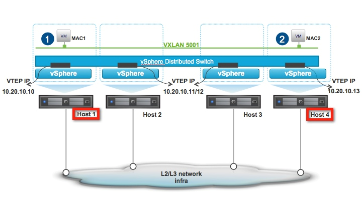
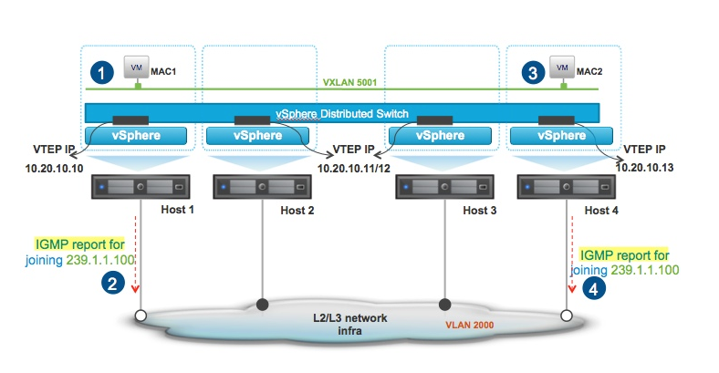
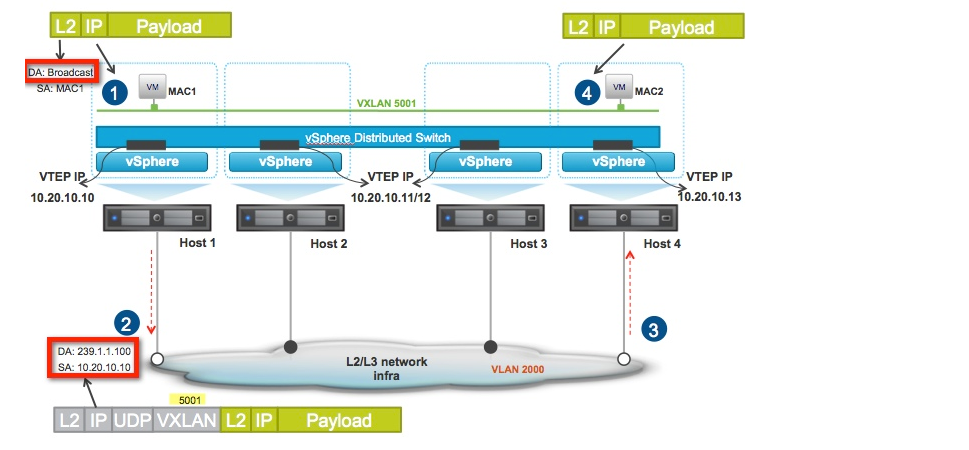
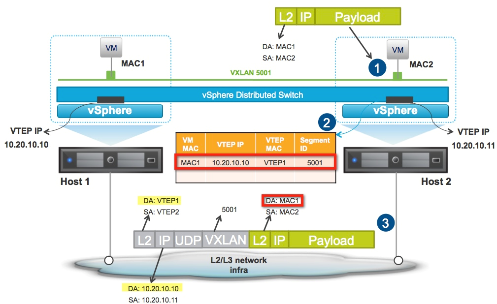

# Tìm hiểu VXLAN

### ***Mục lục***

[1. Tổng quan VXLAN ](#1)

- [1.1  VXLAN là gì? ](#1.1)

[2. Cách hoạt động của VXLAN ](#2)

- [2.1  VM gửi request tham gia vào group multicast](#2.1)

- [2.2  VTEP học và tạo bảng forwarding](#2.2)

[3. VTEP và Encapsulation ](#3)

# 1. Tổng quan VXLAN 

## 1.1  VXLAN là gì?

- VXLAN là viết tắt của Virtual Extensible LAN, được định nghĩa trong RFC 7348 là một công nghệ overlay được thiết kế để cung cấp các dịch vụ kết nối Layer 2 và Layer 3 thông qua mạng IP. Mạng IP cung cấp khả năng mở rộng, hiệu suất cân bằng và khả năng phục hồi khi có lỗi xảy ra. VXLAN đạt được điều này bằng cách tạo các Frames Layer 2 bên trong IP Packets. VXLAN chỉ yêu cầu khả năng giao tiếp IP giữa các thiết bị biên trong mô hình VXLAN, được cung cấp bởi các giao thức định tuyến.

- Trong chuẩn định nghĩa cho VLAN 802.1q chỉ dành ra 12 bit để đánh VLAN-ID. VXLAN sử dụng 24 bit để đánh địa chỉ VLAN_ID. Nghĩa là nó sẽ hỗ trợ không gian địa chỉ VXLAN_ID lên tới 4 lần so với VLAN, tức là khoảng hơn 16 triệu.

- VXLAN sử dụng IP (cả unicast và multicast) như phương tiện truyền. 

# 2. Cách hoạt động của VXLAN

VXLAN hoạt động dựa trên việc gửi các frame thông qua giao thức IP Multicast. 

Trong quá trình cấu hình VXLAN, cần cấp phát địa chỉ IP multicast để gán với VXLAN sẽ tạo. Mỗi địa chỉ IP multicast sẽ đại diện cho một VXLAN. 

Sau đây sẽ tìm hiểu hoạt động chi tiết cách frame đi qua VTEP và đi qua mạng vật lý trong VXLAN triển khai trên một mạng logic với mô hình như sau:

   

## 2.1.  VM gửi request tham gia vào group multicast

Giả sử một mạng logic trên 4 host như hình. Topo mạng vật lý cung cấp một VLAN 2000 để vận chuyển các lưu lượng VXLAN. Trong trường hợp này, chỉ IGMP snooping và IGMP querier được cấu hình trên mạng vật lý. Một vài bước sẽ được thực hiện trước khi các thiết bị trên mạng vật lý có thể xử lý các gói tin multicast. 

- IGMP Packet flows:
   
   - 1) Máy ảo VM (MAC1) trên Host 1 được kết nối tới một mạng logical layer 2 mà có VXLAN 5001 ở đó. 
   
   - 2) VTEP trên Host 1 gửi bản tin IGMP để join vào mạng và join vào nhóm multicast 239.1.1.100 để kết nối tới VXLAN 5001. 
   
   - 3) Tương tự, máy ảo VM (MAC2) trên Host 4 được kết nối tới mạng mà có VXLAN 5001.
   
   - 4) VTEP trên Host 4 gửi bản tin IGMP join vào mạng và join vào nhóm multicast 239.1.1.100 để kết nối tới VXLAN 5001. 

   Host 2 và Host 3 VTEP không join nhóm multicast. Chỉ VTEP nào cần tham gia vào nhóm multicast mới gửi request join vào nhóm 

- Multicast Packet flow:

   - 1) Máy ảo VM (MAC1) trên Host 1 sinh ra một frame broadcast.
   
   - 2) VTEP trên Host 1 đóng gói frame broadcast này vào một UDP header với IP đích là địa chỉ IP multicast 239.1.1.100
   
   - 3) Mạng vật lý sẽ chuyển các gói tin này tới Host 4 VTEP, vì nó đã join vào nhóm multicast 239.1.1.100. Host 2 và 3 VTEP sẽ không nhận được frame broadcast này.
   
   - 4) VTEP trên Host 4 đầu tiên đối chiếu header được đóng gói, nếu 24 bit VNI trùng với ID của VXLAN. Nó sẽ decapsulated lớp gói được VTEP host 1 đóng vào và chuyển tới máy ảo VM đích (MAC2).

## 2.2.  VTEP học và tạo bảng forwarding
 
Ban đầu, mỗi VTEP sau khi đã join vào nhóm IP multicast đều có một bảng forwarding table như sau: 

Các bước sau sẽ được thực hiện để VTEP học và ghi vào bảng forwarding table: 

- Đầu tiên, một bản tin ARP request được gửi từ VM MAC1 để tìm địa chỉ MAC của máy ảo đích nó cần gửi tin đến VM MAC2 trên Host 2. ARP request là bản tin broadcast. 

   

   Host 2 VTEP – Forwarding table entry
   
   - 1) VM trên Host 1 gửi bản tin ARP request với địa chỉ MAC đích là “FFFFFFFFFFF”
   
   - 2) VTEP trên Host 1 đóng gói vào frame Ethernet broadcast vào một UDP header với địa chỉ IP đích multicast và địa chỉ IP nguồn 10.20.10.10 của VTEP.
   
   - 3) Mạng vật lý sẽ chuyển gói tin multicast tới các host join vào nhóm IP multicast  “239.1.1.10”.
   
   - 4) VTEP trên Host 2 nhận được gói tin đã đóng gói. Dựa vào outer và inner header, nó sẽ tạo một entry trong bảng forwarding chỉ ra mapping giữa MAC của máy VM MAC1 ứng với VTEP nguồn và địa chỉ IP  của nó. VTEP cũng kiểm tra VNI của gói tin để quyết định sẽ chuyển tiếp gói tin vào trong cho máy ảo VM bên trong nó hay không.
   
   - 5) Gói tin được de-encapsulated và chuyển vào tới VM mà được kết nối tới VXLAN 5001.

- Hình sau minh họa cách mà VTEP tìm kiếm thông tin trong forwarding table để gửi unicast trả lời lại từ VM từ VTEP 2:

   

   - 1) Máy ảo VM MAC2 trên Host 2 đáp trả lại bản tin ARP request bằng cách gửi unicast lại gói tin với địa chỉ MAC đích là địa chỉ MAC1

   - 2) Sau khi nhận được gói tin unicast đó, VTEP trên Host 2 thực hiện tìm kiếm thông tin trong bảng forwarding table và lấy được thông tin ứng với MAC đích là MAC 1. VTEP sẽ biết rằng phải chuyển gói tin tới máy ảo VM MAC 1 bằng cách gửi gói tin tới VTEP có địa chỉ “10.20.10.10”.

   - 3) VTEP tạo bản tin unicast với địa chỉ đích là  “10.20.10.10” và gửi nó đi. 

- Trên Host 1, VTEP sẽ nhận được gói tin unicast và cũng học được vị trí của VM MAC2 như hình sau: 

   

   Host 1 VTEP – Forwarding table entry
   
   - 1) Gói tin được chuyển tới Host 1
   
   - 2) VTEP trên Host 1 nhận được gói tin. Dựa trên outer và inner header, nó tạo một entry trong bảng forwarding ánh xạ địa chỉ MAC 2 và VTEP trên Host 2. VTEP cũng check lại VNI và quyết định gửi frame vào các VM bên trong. 
   
   - 3) Gói tin được de-encapsulated và chuyển tới chính xác VM có MAC đích trùng và nằm trong VXLAN 5001.

Các bước trên là quá trình hoạt động trong VXLAN. 

### 3.  Encapsulation và VTEP

- VXLAN là công nghệ overlay qua lớp mạng. Overlay Network có thể được định nghĩa như là một mạng logic mà được tạo trên một nền tảng mạng vật lý đã có sẵn.
VXLAN tạo một mạng vật lý layer 2 trên lớp mạng IP. Dưới đây là 2 từ khóa được dùng trong công nghệ overlay network:

   - **Encapsulate**: Đóng gói những gói tin ethernet thông thường trong một header mới. Ví dụ: trong công nghệ overlay IPSec VPN, đóng gói gói tin IP thông thường vào một IP header khác. 

   - **VTEP**: VTEP – Virtual Tunnel Endpoint: là các thiết bị phần cứng hoặc phần mềm, được đặt ở các vùng biên của mạng, chịu trách nhiệm khởi tạo VXLAN Tunnel và thực hiện đóng gói và giải mã VXLAN
   
### VTEP:
- Khi bạn áp dụng vào với công nghệ overlay trong VXLAN, bạn sẽ thấy VXLAN sẽ đóng gói một frame MAC thông thường vào một UDP header. Và tất cả các host tham gia vào VXLAN thì hoạt động như một tunnel end points. Chúng gọi là Virtual Tunnel Endpoints (VTEPs)

- VTEPs là các node mà cung cấp các chức năng Encalsulation và De-encapsulation. Chúng biết rõ được làm thế nào mà VTEPs encap và de-encap lưu lượng từ bất kì máy ảo kết nối với một mạng VXLAN dựa trên mạng vật lý layer 2. 

- VXLAN học tất cả các địa chỉ MAC của máy ảo và việc kết nối nó tới VTEP IP thì được thực hiện thông qua sự hỗ trợ của mạng vật lý. Một trong những giao thức được sử dụng trong mạng vật lý là IP multicast. VXLAN sử dụng giao thức của IP multicast để cư trú trong bảng forwarding trong VTEP.

- Do sự đóng gói (encapsulation) này, VXLAN có thể được gọi là thiết lập đường hầm (tunneling) để kéo dài mạng lớp 2 thông qua lớp 3. 

- ***Lưu ý***: VTEP có thể nằm trên switch hoặc server vật lý và có thể được thực hiện trên phần mềm hoặc phần cứng. 