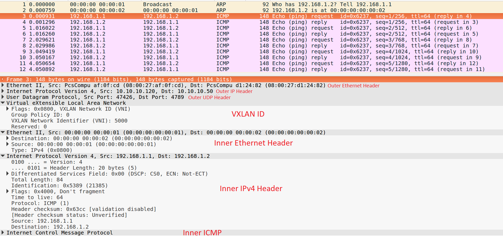

# Lab Vxlan ping giữa 2 VM khác VLAN

### ***Mục lục***

[1. Lab VxLAN ](#1)

- [1.1.  Requirements](#1.1)

- [1.2.  Cấu hình máy ](#1.2)

- [1.3.  Thực hiện](#1.3)


[2. Kết quả ](#2)

---

<a name = '1'></a>
# 1. Lab VxLAN

<a name = '1.1'></a>
## Requirements:
wget libtool autoconf automake make gcc libssl-dev python python-pip  
iputils-ping net-tools tcpdump python-setuptools six ovs

<a name = '1.2'></a>
## Cấu hình máy:  
Host 1:
  - Hệ điều hành Ubuntu 16.04
  - CPU: 6 Core
  - RAM: 8 GB
  - network interface enp0s3: 10.10.10.120/24

Host 2:
  - Hệ điều hành Ubuntu 16.04
  - CPU: 6 Core
  - RAM: 8 GB
  - network interface enp0s3: 10.10.10.50/24

<a name = '1.3'></a>
## Thực hiện: 
## Trên host 1

### Install requirements
```
apt-get update
apt-get install --no-install-recommends -y wget libtool autoconf automake make gcc libssl-dev python python-pip iputils-ping net-tools tcpdump python-setuptools  
pip install six ovs
```

### Download and Install OVS
```
wget http://openvswitch.org/releases/openvswitch-2.9.0.tar.gz  
tar -zxvf openvswitch-2.9.0.tar.gz  
rm openvswitch-2.9.0.tar.gz  
cd openvswitch-2.9.0  
./boot.sh  
./configure --enable-shared  
make  
make install  
cd - 
```
### Clean up    
```
apt-get purge --auto-remove -y wget libtool autoconf automake make gcc python-pip  
apt-get clean  
rm -rf /var/lib/apt/lists/* openvswitch-2.9.0
```

### Create the initial OVS and VTEP schemas    
```
mkdir -p /usr/local/etc/openvswitch /usr/local/var/run/openvswitch  
mkdir -p /usr/local/var/log/openvswitch  
ovsdb-tool create /usr/local/etc/openvswitch/ovs.db /usr/local/share/openvswitch/vswitch.ovsschema  
ovsdb-tool create /usr/local/etc/openvswitch/vtep.db /usr/local/share/openvswitch/vtep.ovsschema 
```

### Start OVSDB server
```
ovsdb-server --pidfile --detach --log-file --remote punix:/usr/local/var/run/openvswitch/db.sock --remote=db:hardware_vtep,Global,managers /usr/local/etc/openvswitch/ovs.db /usr/local/etc/openvswitch/vtep.db
```

### Start ovs-vswitchd
```
ovs-vswitchd --log-file --pidfile --detach unix:/usr/local/var/run/openvswitch/db.sock
```
### Create a Switch
```
ovs-vsctl add-br br0
```

### Create a Port (VM)
```
ovs-vsctl add-port br0 vm1 tag=10 -- set interface vm1 type=internal
```

### Set the Addresses
```
ifconfig vm1 hw ether 00:00:00:00:00:01  
ifconfig vm1 192.168.1.1/24 up
```

### Start VTEP Emulator
```
vtep-ctl add-ps br0  
vtep-ctl set Physical_Switch br0 tunnel_ips=10.10.10.120  
/usr/local/share/openvswitch/scripts/ovs-vtep --log-file --pidfile --detach br0
```

### Set up Logical Network
Thêm một logical switch và gán cho nó tunnel_key (VXLAN ID) là 5000  
```
vtep-ctl add-ls ls0  
vtep-ctl set Logical_Switch ls0 tunnel_key=5000
```

Tiếp theo chúng ta cần liên kết logical switch với port/vlan trên physical switch
```
vtep-ctl bind-ls br0 vm1 0 ls0
```

Cuối cùng, chúng ta thêm địa chỉ MAC của VM và physical locator.
```
vtep-ctl add-ucast-remote ls0 00:00:00:00:00:02 10.10.10.50  
```
Điều này để thông báo cho bộ chuyển mạch: Đối với tất cả khung L2 có địa chỉ đích là 00:00:00:00:00:02, hãy bọc nó và gửi gói đã đóng gói đến 10.10.10.50

Còn 1 tip cuối :))  
Do các gói đầu tiên thường là yêu cầu broadcast ARP. Trong cơ sở dữ liệu VTEP, bảng mcast_macs_remote chỉ định cách xử lý lưu lượng BUM. Vì thế cần thêm 1 lệnh để thông báo cho switch: đối với các gói có địa chỉ đích không xác định (không xuất hiện trong bảng từ xa ucast_macs), hãy gửi chúng đến 10.10.10.50 
``` 
vtep-ctl add-mcast-remote ls0 unknown-dst 10.1.0.1
```


## Trên host 2
Thực hiện tương tự host 1, chỉ khác một vài điểm:

### Create a Switch
```
ovs-vsctl add-br br0
```

### Create a Port (VM)
```
ovs-vsctl add-port br0 vm2 tag=20 -- set interface vm1 type=internal
```

### Set the Addresses
```
ifconfig vm2 hw ether 00:00:00:00:00:02 
ifconfig vm2 192.168.1.2/24 up
```

### Start VTEP Emulator
```
vtep-ctl add-ps br0  
vtep-ctl set Physical_Switch br0 tunnel_ips=10.10.10.50  
/usr/local/share/openvswitch/scripts/ovs-vtep --log-file --pidfile --detach br0
```

### Set up Logical Network
Thêm một logical switch và gán cho nó tunnel_key (VXLAN ID) là 5000  
```
vtep-ctl add-ls ls0  
vtep-ctl set Logical_Switch ls0 tunnel_key=5000
```

Tiếp theo chúng ta cần liên kết logical switch với port/vlan trên physical switch
```
vtep-ctl bind-ls br0 vm2 0 ls0
```

Cuối cùng, chúng ta thêm địa chỉ MAC của VM và physical locator.
```
vtep-ctl add-ucast-remote ls0 00:00:00:00:00:01 10.10.10.120   
```
Điều này để thông báo cho bộ chuyển mạch: Đối với tất cả khung L2 có địa chỉ đích là 00:00:00:00:00:01, hãy bọc nó và gửi gói đã đóng gói đến 10.10.10.120

<a name = '2'></a>
# 2. Kết quả

## Thực hiện ping ở host 1 
```
ping -I vm1 -c 5 192.168.1.2
```
Kết quả nhận được: 


## Phân tích gói tin
### Gói ARP


### Gói ICMP


Hoàn thành xuất sắc :vv Đi uống beer thôiii


