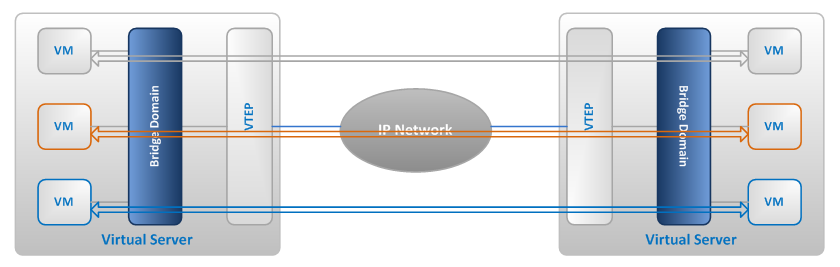

# Tìm hiểu VXLAN

### ***Mục lục***

[1. Tổng quan VXLAN ](#1)

- [1.1.  Đặt vấn đề](#1.1)

- [1.2.  VXLAN là gì? ](#1.2)

- [1.3.  Các khái niệm trong VXLAN](#1.3)

   - [1.3.1.   VNI ](#1.3.1)

   - [1.3.2.   Encapsulation và VTEP ](#1.3.2)

   - [1.3.3.   VXLAN frame format ](#1.3.3)

[2. Cách hoạt động của VXLAN ](#2)

- [2.1.  VM gửi request tham gia vào group multicast](#2.1)

- [2.2.  VTEP học và tạo bảng forwarding](#2.2)

[3. VXLAN Lab ](#3)

[4. VXLAN Lab 2](#4)

[5. Tham khảo ](#5)

---

<a name = '1'></a>
# 1. Tổng quan VXLAN 


<a name = '1.1'></a>
## 1.1.  Đặt vấn đề

Theo truyền thống, tất cả các trung tâm dữ liệu data center sử dụng VLAN để cô lập mạng lớp 2. Do data center ngày càng lớn và cần mở rộng mạng nên những hạn chế của VLAN là hiển nhiên gây ra sự thiếu xót. Những hạn chế đó là: 

- Trong một data center, yêu cầu lên tới hàng ngàn VLAN để phân tách các dòng lưu lượng trong các môi trường đa thuê bao cùng chia sẻ kiến trúc mạng L2/L3 trong Cloud Service Provider. Mà sự hạn chế của 4096 VLAN là con số không đủ.

- Trong mỗi server ảo, mỗi máy ảo VM yêu cầu một địa chỉ MAC và một IP riêng biệt. Do đó, có hàng ngàn MAC table entries trên upstream switches. Điểm này đặt ra nhu cầu lớn hơn về dung lượng bảng của thiết bị chuyển mạch.

- VLAN quá hạn chế trong vấn đề khoảng cách và triển khai. VTP có thể được sử dụng để triển khai VLAN thông qua L2 switch nhưng không hầu hết mọi người thích VTP do những hạn chế của nó.

- Sử dụng STP cung cấp một topology L2 chống loop và cắt bỏ đi hầu hết những liên kết dư thừa. Do đó, Equal-Cost Multi-Path (ECMP) khó để đạt được. Tuy nhiên, ECMP thì lại dễ dàng thực hiện trong lớp mạng IP. 

   => Sự ra đời của VXLAN.


<a name = '1.2'></a>
## 1.2.  VXLAN là gì?

- Như tên của nó - **VXLAN (Virtual eXtensible LANs)**: đây là công nghệ cung cấp dịch vụ để kết nối Ethernet tới các thiết bị cuối như VLAN ngày nay, nhưng có nhiều tính năng mở rộng hơn. So sánh với VLAN, VXLAN được mở rộng hơn về quy mô và khả năng triển khai chúng. 

- Trong chuẩn định nghĩa cho VLAN 802.1q chỉ dành ra 12 bit để đánh VLAN-ID. VXLAN sử dụng 24 bit để đánh địa chỉ VLAN_ID. Nghĩa là nó sẽ hỗ trợ không gian địa chỉ VXLAN_ID lên tới 4 lần so với VLAN, tức là khoảng hơn 16 triệu.

- VXLAN sử dụng IP (cả unicast và multicast) như phương tiện truyền. 

<a name = '1.3'></a>
## 1.3.  Các khái niệm trong VXLAN


<a name = '1.3.1'></a>
### 1.3.1.   VNI

- VXLAN hoạt động trên cơ sở hạ tầng mạng hiện có và cung cấp một phương tiện để *"kéo dài"* một mạng lớp 2. VXLAN là một mạng lớp 2 overlay trên mạng lớp 3. Mỗi lớp mạng như vậy được gọi là VXLAN segment. Chỉ các máy trong cùng VXLAN segment mới có thể giao tiếp với nhau. Mỗi VXLAN segment được xác định thông qua ID kích thước 24 bit, gọi là **VXLAN Network Identifier (VNI)**. Điều này cho phép tối đa 16 triệu các VXLAN segment cùng tồn tại trong cùng một domain.

- VNI xác định phạm vi của inner MAC frame sinh ra bởi máy ảo VM. Do đó, bạn có thể overlapping địa chỉ MAC thông qua segment như không bị lẫn lộn các lưu lượng bởi chúng đã bị cô lập  bởi VNI khác nhau. VNI nằm trong header được đóng gói với innere MAC sinh ra bởi VM. 

   


<a name = '1.3.2'></a>
### 1.3.2.   Encapsulation và VTEP

- VXLAN là công nghệ overlay qua lớp mạng. Overlay Network có thể được định nghĩa như là một mạng logic mà được tạo trên một nền tảng mạng vật lý đã có sẵn.
VXLAN tạo một mạng vật lý layer 2 trên lớp mạng IP. Dưới đây là 2 từ khóa được dùng trong công nghệ overlay network:

   - **Encapsulate**: Đóng gói những gói tin ethernet thông thường trong một header mới. Ví dụ: trong công nghệ overlay IPSec VPN, đóng gói gói tin IP thông thường vào một IP header khác. 

   - **VTEP**: VTEP – Virtual Tunnel Endpoint: là các thiết bị phần cứng hoặc phần mềm, được đặt ở các vùng biên của mạng, chịu trách nhiệm khởi tạo VXLAN Tunnel và thực hiện đóng gói và giải mã VXLAN
   

- Khi bạn áp dụng vào với công nghệ overlay trong VXLAN, bạn sẽ thấy VXLAN sẽ đóng gói một frame MAC thông thường vào một UDP header. Và tất cả các host tham gia vào VXLAN thì hoạt động như một tunnel end points. Chúng gọi là Virtual Tunnel Endpoints (VTEPs)

- VTEPs là các node mà cung cấp các chức năng Encalsulation và De-encapsulation. Chúng biết rõ được làm thế nào mà VTEPs encap và de-encap lưu lượng từ bất kì máy ảo kết nối với một mạng VXLAN dựa trên mạng vật lý layer 2. 

   

- VXLAN học tất cả các địa chỉ MAC của máy ảo và việc kết nối nó tới VTEP IP thì được thực hiện thông qua sự hỗ trợ của mạng vật lý. Một trong những giao thức được sử dụng trong mạng vật lý là IP multicast. VXLAN sử dụng giao thức của IP multicast để cư trú trong bảng forwarding trong VTEP.

- Do sự đóng gói (encapsulation) này, VXLAN có thể được gọi là thiết lập đường hầm (tunneling) để kéo dài mạng lớp 2 thông qua lớp 3. 

- ***Lưu ý***: VTEP có thể nằm trên switch hoặc server vật lý và có thể được thực hiện trên phần mềm hoặc phần cứng. 


<a name = '1.3.3'></a>
### 1.3.3.   VXLAN frame format


Frame Ethernet thông thường bao gồm địa chỉ MAC nguồn, MAC đích, Ethernet type và thêm phần VLAN_ID (802.1q) nếu có. Đây là frame được đóng gói sử dụng VXLAN, thêm các header sau: 

- **VXLAN header**: 8 byte bao gồm các trường quan trọng sau: 

   -  ***Flags***: 8 bit, trong đó bit thứ 5 (I flag) được thiết lập là 1 để chỉ ra rằng đó là một frame có VNI có giá trị. 7 bit còn lại dùng dữ trữ được thiết lập là 0.

   -  ***VNI***: 24 bit cung cấp định danh duy nhất cho VXLAN segment. Các VM trong các VXLAN khác nhau không thể giao tiếp với nhau. 24 bit VNI cung cấp lên tới hơn 16 triệu VXLAN segment trong một vùng quản trị mạng. 

- **Outer UDP Header**: port nguồn của Outer UDP được gán tự động và sinh ra bởi VTEP và port đích thông thường được sử dụng là port 4789 hay được sử dụng (có thể chọn port khác).

- **Outer IP Header**: Cung cấp địa chỉ IP nguồn của VTEP nguồn kết nối với VM bên trong. Địa chỉ IP outer đích là địa chỉ IP của VTEP nhận frame.

- **Outer Ethernet Header**: cung cấp địa chỉ MAC nguồn của VTEP có khung frame ban đầu. Địa chỉ MAC đích là địa chỉ của hop tiếp theo được định tuyến bởi VTEP. Outer Ethernet header có thể được gắn tag theo chuẩn 802.1q trong quá trình vận chuyển trong mạng.

<a name = '2'></a>
# 2. Cách hoạt động của VXLAN

VXLAN hoạt động dựa trên việc gửi các frame thông qua giao thức IP Multicast. 

Trong quá trình cấu hình VXLAN, cần cấp phát địa chỉ IP multicast để gán với VXLAN sẽ tạo. Mỗi địa chỉ IP multicast sẽ đại diện cho một VXLAN. 

Sau đây sẽ tìm hiểu hoạt động chi tiết cách frame đi qua VTEP và đi qua mạng vật lý trong VXLAN triển khai trên một mạng logic với mô hình như sau:

   

<a name = '2.1'></a>
## 2.1.  VM gửi request tham gia vào group multicast

Giả sử một mạng logic trên 4 host như hình. Topo mạng vật lý cung cấp một VLAN 2000 để vận chuyển các lưu lượng VXLAN. Trong trường hợp này, chỉ IGMP snooping và IGMP querier được cấu hình trên mạng vật lý. Một vài bước sẽ được thực hiện trước khi các thiết bị trên mạng vật lý có thể xử lý các gói tin multicast. 


- IGMP Packet flows:
   
   - 1) Máy ảo VM (MAC1) trên Host 1 được kết nối tới một mạng logical layer 2 mà có VXLAN 5001 ở đó. 
   
   - 2) VTEP trên Host 1 gửi bản tin IGMP để join vào mạng và join vào nhóm multicast 239.1.1.100 để kết nối tới VXLAN 5001. 
   
   - 3) Tương tự, máy ảo VM (MAC2) trên Host 4 được kết nối tới mạng mà có VXLAN 5001.
   
   - 4) VTEP trên Host 4 gửi bản tin IGMP join vào mạng và join vào nhóm multicast 239.1.1.100 để kết nối tới VXLAN 5001. 

   Host 2 và Host 3 VTEP không join nhóm multicast. Chỉ VTEP nào cần tham gia vào nhóm multicast mới gửi request join vào nhóm 


- Multicast Packet flow:

   - 1) Máy ảo VM (MAC1) trên Host 1 sinh ra một frame broadcast.
   
   - 2) VTEP trên Host 1 đóng gói frame broadcast này vào một UDP header với IP đích là địa chỉ IP multicast 239.1.1.100
   
   - 3) Mạng vật lý sẽ chuyển các gói tin này tới Host 4 VTEP, vì nó đã join vào nhóm multicast 239.1.1.100. Host 2 và 3 VTEP sẽ không nhận được frame broadcast này.
   
   - 4) VTEP trên Host 4 đầu tiên đối chiếu header được đóng gói, nếu 24 bit VNI trùng với ID của VXLAN. Nó sẽ decapsulated lớp gói được VTEP host 1 đóng vào và chuyển tới máy ảo VM đích (MAC2).


<a name = '2.2'></a>
## 2.2.  VTEP học và tạo bảng forwarding
 
Ban đầu, mỗi VTEP sau khi đã join vào nhóm IP multicast đều có một bảng forwarding table như sau: 


Các bước sau sẽ được thực hiện để VTEP học và ghi vào bảng forwarding table: 

- Đầu tiên, một bản tin ARP request được gửi từ VM MAC1 để tìm địa chỉ MAC của máy ảo đích nó cần gửi tin đến VM MAC2 trên Host 2. ARP request là bản tin broadcast. 

   

   Host 2 VTEP – Forwarding table entry
   
   - 1) VM trên Host 1 gửi bản tin ARP request với địa chỉ MAC đích là “FFFFFFFFFFF”
   
   - 2) VTEP trên Host 1 đóng gói vào frame Ethernet broadcast vào một UDP header với địa chỉ IP đích multicast và địa chỉ IP nguồn 10.20.10.10 của VTEP.
   
   - 3) Mạng vật lý sẽ chuyển gói tin multicast tới các host join vào nhóm IP multicast  “239.1.1.10”.
   
   - 4) VTEP trên Host 2 nhận được gói tin đã đóng gói. Dựa vào outer và inner header, nó sẽ tạo một entry trong bảng forwarding chỉ ra mapping giữa MAC của máy VM MAC1 ứng với VTEP nguồn và địa chỉ IP  của nó. VTEP cũng kiểm tra VNI của gói tin để quyết định sẽ chuyển tiếp gói tin vào trong cho máy ảo VM bên trong nó hay không.
   
   - 5) Gói tin được de-encapsulated và chuyển vào tới VM mà được kết nối tới VXLAN 5001.

- Hình sau minh họa cách mà VTEP tìm kiếm thông tin trong forwarding table để gửi unicast trả lời lại từ VM từ VTEP 2:

   

   - 1) Máy ảo VM MAC2 trên Host 2 đáp trả lại bản tin ARP request bằng cách gửi unicast lại gói tin với địa chỉ MAC đích là địa chỉ MAC1

   - 2) Sau khi nhận được gói tin unicast đó, VTEP trên Host 2 thực hiện tìm kiếm thông tin trong bảng forwarding table và lấy được thông tin ứng với MAC đích là MAC 1. VTEP sẽ biết rằng phải chuyển gói tin tới máy ảo VM MAC 1 bằng cách gửi gói tin tới VTEP có địa chỉ “10.20.10.10”.

   - 3) VTEP tạo bản tin unicast với địa chỉ đích là  “10.20.10.10” và gửi nó đi. 

- Trên Host 1, VTEP sẽ nhận được gói tin unicast và cũng học được vị trí của VM MAC2 như hình sau: 

   

   Host 1 VTEP – Forwarding table entry
   
   - 1) Gói tin được chuyển tới Host 1
   
   - 2) VTEP trên Host 1 nhận được gói tin. Dựa trên outer và inner header, nó tạo một entry trong bảng forwarding ánh xạ địa chỉ MAC 2 và VTEP trên Host 2. VTEP cũng check lại VNI và quyết định gửi frame vào các VM bên trong. 
   
   - 3) Gói tin được de-encapsulated và chuyển tới chính xác VM có MAC đích trùng và nằm trong VXLAN 5001.

Các bước trên là quá trình hoạt động trong VXLAN.  

<a name = '3'></a>
# 3. VXLAN Lab (Mô hình phần này khác với mô hình ở phần 2)

Trong bài lab này em sẽ thiết lập một topology như hình vẽ  
   
   All scripts used in this lab can be found at [Github](https://github.com/hechaoli/vxlan-lab).

## OVS VTEP Emulator
I will use a docker image of the OVS VTEP emulator I have set up. The image is available on [Dockerhub](https://hub.docker.com/r/hechaol/ovs-vtep-emulator/).

This image has ovs installed but no process is running. After start the container, we can start ovsdb-server and ovs-vswitched by the script start_ovs.sh.

## Set up Topology
We are going to set up a topology similar to the one shown above. Thus we need two VTEP emulators to simulate the hypervisors. docker-compose can be used to set up the topology. The docker-compose.yml file is shown as follows:

```php
version: '2'
services:
  hv1:
      image: hechaol/ovs-vtep-emulator:2.9.0
      # Keep the container running after start
      entrypoint: ["/bin/bash", "-c", "/start_ovs.sh && tail -f /dev/null"]
      privileged: true
      networks:
          underlay:
              ipv4_address: 10.0.0.1
  hv2:
      image: hechaol/ovs-vtep-emulator:2.9.0
      # Keep the container running after start
      entrypoint: ["/bin/bash", "-c", "/start_ovs.sh && tail -f /dev/null"]
      privileged: true
      networks:
          underlay:
              ipv4_address: 10.1.0.1

networks:
    underlay:
        driver: bridge
        ipam:
            config:
                - subnet: 10.0.0.0/8
                  gateway: 10.0.0.254
```

Note: To simplify the lab, I have put the two emulators in the same IP network 10.0.0.0/8. That is, there is no router between hv1 and hv2. This is the only difference to above topology.

## Set up Emulator (Hypervisor)
Each emulator has one switch on it with one port that is used to simulate the VM. I will only show how to set up the first emulator step by step. The second one can be set up in similar way. And the scripts to set up the two emulator can be found here.

## Create a Switch
First, we create a new switch (the yellow box named “switch interface” in the topology) with ovs-vsctl:
```php
$ ovs-vsctl add-br br0
``` 

## Create a Port (VM)
Second, we create a port that is used to simulate the VM. We call this port vm1:
```php
$ ovs-vsctl add-port br0 vm1 -- set interface vm1 type=internal
```
Note: Since this is a virtual port, we need to set its type to internal. For more information, see ovs-vsctl.

Confirm the switch and port are added:
```php
$ ovs-vsctl show
````  

## Set the Addresses
Third, we set vm1’s MAC address and IP address.

```php
$ ifconfig vm1 hw ether 00:00:00:00:00:01
$ ifconfig vm1 192.168.1.1 netmask 255.255.255.0 up
```

Note 192.168.1.1/24 is the overlay network IP address.

## Start VTEP Emulator
vtep-ctl is used to set up the VTEP database. First, we add the switch br0 to VTEP table and set its tunnel endpoint IP to be the underlay IP. Then we start the VTEP emulator by running script ovs-vtep.
```php
$ vtep-ctl add-ps br0
$ vtep-ctl set Physical_Switch br0 tunnel_ips=10.0.0.1
$ /usr/local/share/openvswitch/scripts/ovs-vtep --log-file --pidfile --detach br0
```

Confirm that the physical switch is added:
```php
$ vtep-ctl list physical_switch
```

## Set up Logical Network
The logical network topology is just two VMs connecting to one switch. In other words, the two VMs think they are in the same L2 network.

Logical Network Topology

In order to set up the logical network, we need to first add a logical switch and set its tunnel key (VXLAN ID) to 5000.
```php
$ vtep-ctl add-ls ls0
$ vtep-ctl set Logical_Switch ls0 tunnel_key=5000
```

Next, we need to bind the logical switch to the port/vlan combination on the “physical” switch. (I use double quote here because our physical switch is actually also virtual). This binding is to tell the physical switch to use this VLAN for this logical switch’s traffic in the underlay network. We may talk about how does a VTEP emulator work in later articles.
```php
$ vtep-ctl bind-ls br0 vm1 0 ls0
```
Finally, we add VM’s MAC address and physical locator.
```php
$ vtep-ctl add-ucast-remote ls0 00:00:00:00:00:02 10.1.0.1
```

This is to tell the switch: For all L2 frame whose destination address is 00:00:00:00:00:02, wrap it and send the encapsulated packet to 10.1.0.1 (hypervisor 2’s tunnel endpoint IP).

And we can do similar configuration on “hypervisor” 2.

Can we ping from VM1 to VM2 now? Unfortunately, the answer is no. We still have one trick to do. On “hypervisor” 1, we need to add a mcast macs remote.
```php
$ vtep-ctl add-mcast-remote ls0 unknown-dst 10.1.0.1
```

Why this is necessary? Remember even in physical world, the first packets between two peers is usually the broadcast ARP request. In VTEP database, mcast_macs_remote table specifies how to handle BUM (Broadcast, Unknown unicast and Multicast) traffic. The command we just use is to tell the switch: for packets whose destination address is unknown (not appear in ucast macs remote table), send them to 10.1.0.1 (Hypervisor 2’s tunnel endpoint IP). This is a hacky trick. Ideally, the BUM packets should be sent to a service node that helps forwards the traffic. For more information, see vtep-ctl.

Now we should be able to ping from VM1 to VM2.
```php
$ ping -I vm1 -c 3 192.168.1.2
PING 192.168.1.2 (192.168.1.2) from 192.168.1.1 vm1: 56(84) bytes of data.
64 bytes from 192.168.1.2: icmp_seq=1 ttl=64 time=0.196 ms
64 bytes from 192.168.1.2: icmp_seq=2 ttl=64 time=0.107 ms
64 bytes from 192.168.1.2: icmp_seq=3 ttl=64 time=0.226 ms

--- 192.168.1.2 ping statistics ---
3 packets transmitted, 3 received, 0% packet loss, time 2076ms
rtt min/avg/max/mdev = 0.107/0.176/0.226/0.051 ms
```

After the first ping, since the switch has already learned the MAC address, even if we delete the mcast mcast remote entry, we should still be able to ping.
```php
$ vtep-ctl del-mcast-remote ls0 unknown-dst 10.1.0.1
$ ping -I vm1 -c 3 192.168.1.2
PING 192.168.1.2 (192.168.1.2) from 192.168.1.1 vm1: 56(84) bytes of data.
64 bytes from 192.168.1.2: icmp_seq=1 ttl=64 time=1.03 ms
64 bytes from 192.168.1.2: icmp_seq=2 ttl=64 time=0.153 ms
64 bytes from 192.168.1.2: icmp_seq=3 ttl=64 time=0.094 ms

--- 192.168.1.2 ping statistics ---
3 packets transmitted, 3 received, 0% packet loss, time 2028ms
rtt min/avg/max/mdev = 0.094/0.427/1.036/0.431 ms
```

## Traffic Analysis
We use tcpdump to capture the packets on emulator 1 and 2. Then we ping from VM1 to VM2 and get the dump. I will listen on interface vm1 and eth0 separately in order to get corresponding traffic in the overlay and underlay network:
```php
$ tcpdump -i vm1 -w vm1_overlay.pcap &
$ tcpdump -i eth0 -w vm1_underlay.pcap &
```
To make the whole process simple, we can use the script run_lab.sh to set up the toplogy, ping from VM1 to VM2 and collect the dump.

## VM1 Overlay Network Traffic


There is literally nothing to say because this is such a classic ping traffic - first a broadcast ARP request is sent and replied and then the ICMP request is sent and replied. But isn’t it amazing? Though VM1 and VM2 are physically in different L2 networks, they think they are in the same one thanks to the VXLAN tunneling!

## VM1 Underlay Network Traffic


The packets of the underlay network is more interesting.

- First, when the L2 frame with destination address ff:ff:ff:ff:ff:ff arrives the bridge, as we mentioned before, since it is part of the BUM traffic, it needs to be sent to physical locator 10.1.0.1 (Remember our trick?). However, the bridge also needs to send an ARP request in order to know the MAC address of hypervisor 2. Thus the first packet in the underlay network is the ARP request that queries the MAC address of 10.1.0.1. The source MAC is hypervisor 1’s MAC adress and the destination MAC is broadcast address.  

- Seoncd, hypervisor 2 (IP 10.1.0.1, MAC 02:42:0a:01:00:01) replies the ARP request.

- The third packet is the ARP request of the overlay network. Wireshark shows two source / destination MAC addresses because one is the underlay MAC address and the other is the overlay MAC address. VXLAN Packet Details 1

- The fourth packet is the ARP reply of the overlay network. Similar to 3.
- The fifth packet is the ICMP request packet of the overlay network. Look at the details of this packet, it matches the packet we draw in the topology: VXLAN Packet Details 2
- The sixth packet is the ICMP reply packet of the overlay network. Similar to 5.

<a name = '4'></a>
# 4. VXLAN Lab 2

## 4.1. Mô hình


### 4.1.1.	Chuẩn bị: 

Yêu cầu 2 máy host

- Chạy ubuntu desktop 14.04. 

- Cài sẵn KVM, virt-manager, OpenvSwitch.

- Trên mỗi máy đã có sẵn một máy ảo VM. Ở đây chỉ dùng tạo máy ảo cirros cho nhỏ gọn.

- Có kiến thức cơ bản về [VXLAN](../4.Tim_hieu_VXLAN.md), [KVM](../KVM) và [Openvswitch](./2.Tim_hieu_Open_Vswitch.md).

### 4.1.2.	Mục đích bài lab: 

- Hiểu cơ bản vê hoạt động của VXLAN.

- Phân tích bản tin VXLAN.

- Cấu hình cơ bản với Openvswitch


## 4.2.	Cấu hình

- Cấu hình 2 HOST 1 và HOST cùng dải mạng 10.10.10.0/24

- Trong mô hình này:

	-	**HOST 1**: eth0 10.10.10.120/24

	-	**HOST 2**: eth0 10.10.10.50/24


### 4.2.1.	Cấu hình tại HOST 1

Cấu hình hai bridge **ovsbr0** - kết nối với các VM, và tạo kết nối tunnel  sử dụng VXLAN tunnel và **ovsbr1** - tunnel endpoint kết nối với card eth0 của máy HOST. Thực chất không cần sử dụng một tunnel endpoint tách biệt như vậy. Tuy nhiên trong thực tế, việc này cho phép tách biệt quản lý lưu lượng của hypervisor và quản lý lưu lượng VXLAN, cho phép sử dụng mạng quản lý bên ngoài.

```
# cau hinh ovsovsovsbr1 lam tunnel endpoint (VTEP)
sudo ovs-vsctl add-br ovsovsbr1
sudo ovs-vsctl add-port ovsovsbr1 eth0
sudo ifconfig eth0 0
sudo ifconfig ovsovsbr1 10.10.10.120/24
# cau hinh ovsbr0 và vxl tunnel interface
sudo ovs-vsctl add-br ovsbr0
sudo ifconfig ovsbr0 172.16.10.1/24
sudo ovs-vsctl add-port ovsbr0 vxl0 -- set interface vxl0 type=vxlan options:remote_ip=10.10.10.50
```

### 4.2.2.	Cấu hình trên HOST 2

Cấu hình tương tự:

```    
sudo ovs-vsctl add-br ovsbr1
sudo ovs-vsctl add-port ovsbr1 eth0
sudo ifconfig eth0 0
sudo ifconfig ovsbr1 10.10.10.50/24
sudo ovs-vsctl add-br ovsbr0
sudo ifconfig ovsbr0 172.16.10.2/24
sudo ovs-vsctl add-port ovsbr0 vxl0 -- set interface vxl0 type=vxlan options:remote_ip=10.10.10.120
```

### 4.2.3.	Tạo mạng VXLAN trong mỗi host

- Thực hiện trên cả 2 HOST.

- Tạo một libvirt network tương ứng với bridge ovsbr0 để kết nối các máy ảo vào. Cấu hình file `vi ovs-vxlan.xml` định nghĩa ovs-vxlan network như sau:

	```
	<network>
	  <name>ovs-vxlan</name>
	  <forward mode='bridge'/>
	  <bridge name='ovsbr0'/>
	  <virtualport type='openvswitch'/>
	</network>
	```

- Lưu lại file cấu hình. Áp dụng cấu hình tạo network mới:

	```
	virsh net-define ovs-vxlan.xml
	virsh net-start ovs-vxlan
	virsh net-autostart ovs-vxlan
	```

### 4.2.4.	Kiểm tra kết nối

Trên HOST 1 tạo máy ảo cirros1, trên HOST 2 tạo máy ảo cirros 2. Cả 2 máy đều kết nối tới mạng ovs-vxlan gán với bridge ovsbr0 trên mỗi HOST và được cấu hình địa chỉ tĩnh (dải 172.16.10.0/24). Tiến hành ping thử giữa hai máy. Kết quả ping thành công như sau:


# 3.	Phân tích trên wireshark
Phân tích một gói tin ICMP bắt được trên interface eth0 có kết quả như sau.


**Kết luận**: Có thể thấy rằng layer 2 frame (chứa thông tin ICMP/IP giữa hai VM cirros1:  172.16.10.10 và  VM cirros2: 172.16.10.20) được đóng gói hoàn toàn trong bản tin VXLAN của các địa chỉ ngoài của 2 HOST:  10.10.10.120 và 10.10.10.50.

<a name = '5'></a>
# 5. Tham khảo

[1] https://github.com/hocchudong/thuctap012017/blob/master/TamNT/Virtualization/docs/4.Tim_hieu_VXLAN.md  
[2] https://hechao.li/2018/05/15/VXLAN-Hands-on-Lab/
