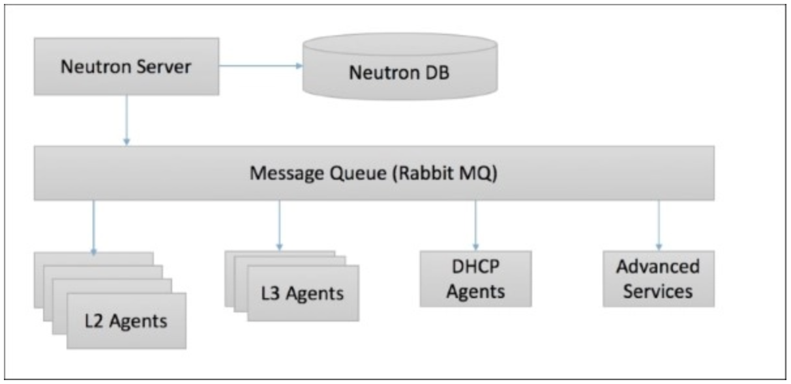
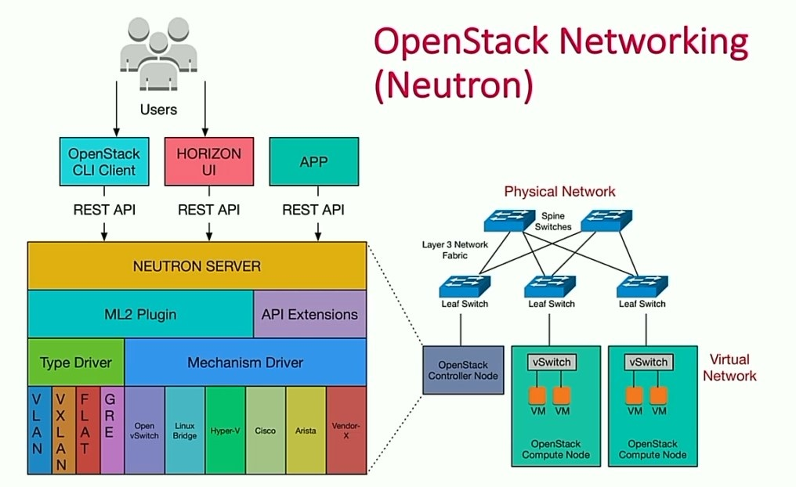
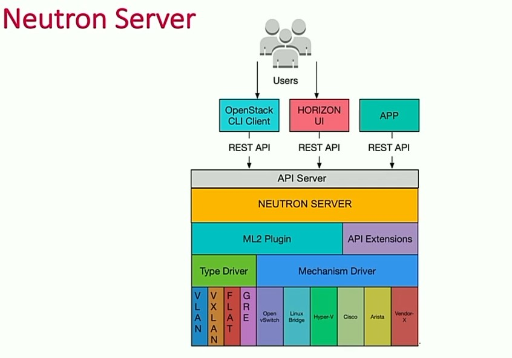
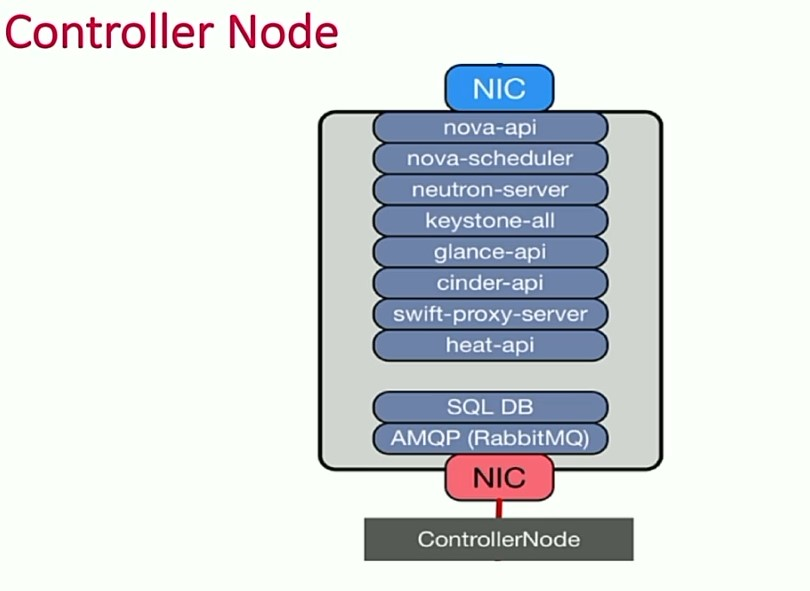
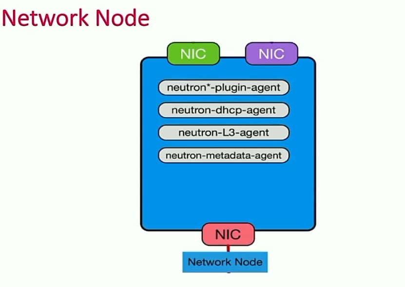
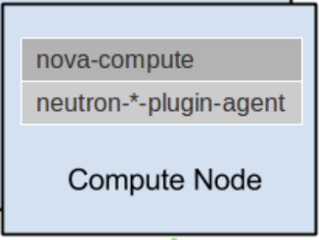
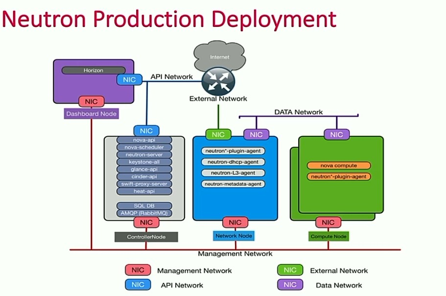
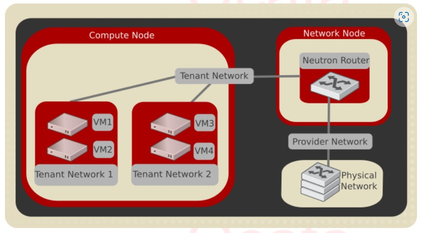

# OpenStack Networking cơ bản

## Mục lục

### [1. Giới thiệu về Neutron](#1)

### [2. Các khái niệm](#2)

### [3. Cấu trúc thành phần và dịch vụ](#3)

- [3.1 Server](#3.1)
- [3.2 Plug-ins](#3.2)
- [3.3 Agents](#3.3)
- [3.4 Services](#3.4)

---------

## <a name="1"> 1. Giới thiệu về Neutron </a>
### <a name ="1.1"> 1.1. Giới thiệu </a>
OpenStack Networking cho phép bạn tạo và quản lí các network objects ví dụ như networks, subnets, và ports cho các services khác của OpenStack sử dụng.  Với kiến trúc plugable, các plug-in có thể được sử dụng để triển khai các thiết bị và phần mềm khác nhau, nó khiến OpenStack có tính linh hoạt trong kiến trúc và triển khai.

Dịch vụ Networking trong OpenStack (neutron) cung cấp API cho phép bạn định nghĩa các kết nối mạng và gán địa chỉ ở trong môi trường cloud. Nó cũng cho phép các nhà khai thác vận hành các công nghệ networking khác nhau cho phù hợp với mô hình điện toán đám mây của riêng họ. Neutron cũng cung cấp một API cho việc cấu hình cũng như quản lí các dịch vụ networking khác nhau từ L3 forwarding, NAT cho tới load balancing, perimeter firewalls, và virtual private networks.

### <a name ="1.2"> 1.2. Thành phần </a>
Neutron có những thành phần sau:

**API server**

OpenStack Networking API hỗ trợ Layer2 networking và IP address management (IPAM - quản lý địa chỉ IP), cũng như một extension để xây dựng router Layer 3 cho phép định tuyến giữa các networks Layer 2 và các gateway để ra mạng bên ngoài. OpenStack Networking cung cấp một danh sách các plug-ins (đang ngày càng tăng lên) cho phép tương tác với nhiều công nghệ mạng mã nguồn mở và cả thương mại, bao gồm các routers, switches, switch ảo và SDN controller.

**OpenStack Networking plug-in and agents**

Các plugin và các agent này cho phép gắn và gỡ các ports, tạo ra network hay subnet, và đánh địa chỉ IP. Lựa chọn plugin và agents nào là tùy thuộc vào nhà cung cấp và công nghệ sử dụng trong hệ thống cloud nhất định. Điều quan trọng là tại một thời điểm chỉ sử dụng được một plug-in.

**Messaging queue**

Tiếp nhận và định tuyến các RPC requests giữa các agents để hoàn thành quá trình vận hành API. Các Message queue được sử dụng trong ML2 plugin để thực hiện truyền thông RPC giữa neutron server và các neutron agents chạy trên mỗi hypervisor, cụ thể là các ML2 driver cho Open vSwitch và Linux bridge.

### <a name ="1.3"> 1.3. Kiến trúc </a>

#### **Các thành phần trong Neutron server**

#### **a. Neutron API Server**
Neutron API Server là đối tượng cho phép client tương tác với Neutron Server. Client có thể tạo RESTful API request tới Neutron server thông qua 1 trong 3 cách sau:

- The OpenStack CLI Client (command-line)
- The Horizon Dashboard (GUI)
- An app to be created using OpenStack software development toolkit

RESTful API request được dùng để CRUD (Create - Read - Update - Delete) các tài nguyên mạng. Các tài nguyên mạng bao gồm: mạng, cổng, subnet, security group, router, firewall. RESTful API sử dụng các HTTP request như POST, GET, PUT & DELETE để thực hiện CRUD với các tài nguyên mạng.
#### **b. ML2 Plug-in**
ML2 Plug-in là một framework cho phép sử dụng đồng thời nhiều công nghệ mạng lớp 2 hiện có trên thị trường. ML2 Plug-in có một số những ưu điểm sau:

- Có thể ảo hóa được nhiều loại thiết bị mạng lớp 2 hiện nay
- Plug-in được module hóa và có thể được tái sử dụng
- Giảm thiểu công sức phát triển và bảo trì

ML2 Plug-in làm cho việc sử dụng công nghệ mạng hay tài nguyên mạng trở nên dễ dàng hơn nhờ sử dụng cơ chế driver. Để có thể ảo hóa nhiều công nghệ hay thiết bị mạng như vậy, ML2 cung cấp driver APIs. Các vendor hoặc nhà phát triển có thể sử dụng driver APIs để phát triển driver cho chính họ. ML2 cung cấp 2 loại driver:

- Network Type Drivers
- Mechanism Drivers
#### **aa. Network Type Drivers**
Network Type Drivers cho phép 1 mạng tenant xây dựng loại mạng cụ thể cho từng project. Một số loại network type được hỗ trợ là: VLAN, VXLAN, GRE và FLAT.
#### **bb. Mechanism Drivers**
Mechanism Drivers cho phép các vendors có thể tích hợp, ảo hóa công nghệ của họ. ML2 cho phép nhiều mechanism drivers được sử dụng cùng nhau trong cùng 1 mạng. 1 số Mechanism Drivers có thể được kể đến là:

- OpenvSwitch, Linux Bridge (đều là open source)
- Cisco (do Cisco tạo nên)

## <a name ="2"> 2. Các khái niệm </a>
### **Node trong Openstack**
Node là một server (có thể là phần cứng hoặc ảo hóa) mà OpenStack services chạy trên chúng. Một số loại node có thể được kể đến như:

- Controller Node
- Compute Node
- Network Node
- Dashboard Node
- Storage Node

#### **a. Controller Node**
Controller Node là một API Server cho tất cả các service của OpenStack như Nova, Neutron, Keystone, Glance, Cinder, Swift, Heat,... Bất kì một API Request nào đều đến Controller Node đầu tiên. Neutron Server là một phần của Controller Node. Dưới đây là sơ đồ kiến trúc của Controller Node  

Controller Node chứa toàn bộ API Server cho tất cả các service của OpenStack. Nó có thể schedule instance, chứa trạng thái của tài nguyên bằng database. Ngoài ra, nó còn chạy AMQP (Advanced Message Queuing Protocol) - giao thức để chạy message broker service. Dịch vụ này hỗ trợ nhận và gửi thông điệp giữa nhiều service chạy trên các node khác nhau.

Sau đây là cách request được nhận bởi Neutron Server chạy trên Controller Node:

- Neutron Server đầu tiên sẽ authenticate bất kì request nào bằng cách gửi chúng tới Keystone Server API process, chạy trên Controller Node
- Sau khi xác minh xong, request được gửi tới Neutron Server's ML2 Plugin
- ML2 Plugin lưu reuqest vào database
- ML2 Network Type Driver allocate VLAN id hoặc VXLAN id for network segmentation
- ML2 Mechanism Driver sử dụng message queue để gửi thông điệp tới ML2 Mechanism Driver Agent chạy trên Compute Node hoặc Network Node
- Plugin agent tiếp nhận request và hoàn thành chúng
#### **b. Network Node**
Network Node provide connection between

- Các mạng khác nhau trong cùng 1 project
- Project network và mạng bên ngoài (VD: internet)

Router namespace được đính kèm với network node để kích hoạt kết nối tới các mạng bên ngoài (external). Ngoài ra, network node còn cung cấp:

- DHCP services to VMs
- Metadata services to VMs  

Sơ đồ trên biểu diễn Network Node Architecture. Network Node cung cấp Layer 3 Routing, floating IP, DHCP and metadata services. Virtual Router chạy trên Network Node được coi như gateway ra mạng external và kết nối các instance trong project network chạy trên compute node. 

#### **c. Compute  Node**
Một compute node chạy dịch vụ quản lý máy ảo  

### **Các loại network**
#### **a. Data Network**
Data Network cung cấp kết nối giữa Compute Node và Network Node. Data Network là network được sử dụng bởi rất nhiều VMs trong project để kết nối:

- Giữa các VMs với nhiều
- Kết nối ra external network
#### **b. Management Network**
Management Network được deploy bởi ML2 Mechanism Driver để kết nối các plug-in agent ở Compute Node và Network Node. Management Network được dùng cho tất cả internal OpenStack communication. Project không có quyền access network này. Management Network kết nối tất cả Controller, Network, Compute, Dashboard Node với nhau. Dưới đây là sơ đồ ví dụ triển khai Neutron  

#### **c. Project Network**
Project Network là network có thể được khởi tạo và quản lý in a self-service manner, bởi một non-privileged project user (a user that is not an administrator). Project Network là một mạng ảo được tạo trên vSwwitches of a compute node. Project Network cung cấp DHCP và metadata service thông qua network node. Trong hầu hết self-service network, type of network is usually VXLAN

- VXLAN hỗ trợ nhiều số lượng mạng hơn VLAN
- VXLAN hoàn toàn được ảo hóa nhở sử dụng overlay
#### **d. Overlay Network**
Overlay Networking liên quan đến việc đóng gói L2 Frame, được gửi bởi VM hoặc Docker container, với VXLAN header. Gói được gửi tới destination host nhờ sử dụng VXLAN tunnel. Tunnel được setup over the existing IP network or underlay. VXLAN cung cấp better network stability, using Layer 3 Routing nếu so sánh với VLANs
#### **e. Provider Network**
Provider network được khởi tạo và quản lý bởi network administrator. Khi provider network được chia sẻ bởi admin, a project user can view and attach their instances to it. Provider network need configuration of the physical infrastructure in the datacenter. Provider network được tạo ra bằng cách mapping the network's segmentation ID to an existing network in the datacenter using VLAN tagging. Physical router in the datacenter provide layer 3 routing and floating IP functions.  

**Subnets**

Là một khối tập hợp các địa chỉ IP và đã được cấu hình. Quản lý các địa chỉ IP của subnet do IPAM driver thực hiện. Subnet được dùng để cấp phát các địa chỉ IP khi ports mới được tạo trên network.

**Subnet pools**

Người dùng cuối thông thường có thể tạo các subnet với bất kì địa chỉ IP hợp lệ nào mà không bị hạn chế. Tuy nhiên, trong một vài trường hợp, sẽ là ổn hơn nếu như admin hoặc tenant định nghĩa trước một pool các địa chỉ để từ đó tạo ra các subnets được cấp phát tự động. 
Sử dụng subnet pools sẽ ràng buộc những địa chỉ nào có thể được sử dụng bằng cách định nghĩa rằng mỗi subnet phải nằm trong một pool được định nghĩa trước. Điều đó ngăn chặn việc tái sử dụng địa chỉ hoặc bị chồng lấn hai subnets trong cùng một pool.

**Floating IPs**
Floating IPs là một service được cung cấp bởi Neutron. Floating IPs are public facing and enable external communication. Floating IPs are assigned by Neutron from a pool on the external network. Admin sets pools of floating IPs. User can associate a floating IP with their instance.

**Ports**

Là điểm kết nối để attach một thiết bị như card mạng của máy ảo tới mạng ảo. Port cũng được cấu hình các thông tin như địa chỉ MAC, địa chỉ IP để sử dụng port đó.

**Router**

Cung cấp các dịch vụ layer 3 ví dụ như định tuyến, NAT giữa các self service và provider network hoặc giữa các self service với nhau trong cùng một project. 

**Security groups**

Một security groups được coi như một firewall ảo cho các máy ảo để kiểm soát lưu lượng bên trong và bên ngoài router. Security groups hoạt động mức port, không phải mức subnet. Do đó, mỗi port trên một subnet có thể được gán với một tập hợp các security groups riêng. Nếu không chỉ định group cụ thể nào khi vận hành, máy ảo sẽ được gán tự động với default security group của project. Mặc định, group này sẽ hủy tất cả các lưu lượng vào và cho phép lưu lượng ra ngoài. Các rule có thể được bổ sung để thay đổi các hành vi đó. 
Security group và các security group rule cho phép người quản trị và các tenant chỉ định loại traffic và hướng (ingress/egress) được phép đi qua port. Một security group là một container của các security group rules.

Các rules trong security group phụ thuộc vào nhau. Vì thế nếu bạn cho phép inbound TCP port 22, hệ thống sẽ tự động tạo ra 1 rule cho phép outbound traffic trả lại và ICMP error messages liên quan tới các kết nối TCP vừa được tạo rules.

Mặc định, mọi security groups chứa các rules thực hiện một số hành động sau:

- Cho phép traffic ra bên ngoài chỉ khi nó sử dụng địa chỉ MAC và IP của port máy ảo, cả hai địa chỉ này được kết hợp tại `allowed-address-pairs`
- Cho phép tín hiệu tìm kiếm DHCP và gửi message request sử dụng MAC của port cho máy ảo và địa chỉ IP chưa xác định.
- Cho phép trả lời các tín hiệu DHCP và DHCPv6 từ DHCP server để các máy ảo có thể lấy IP
- Từ chối việc trả lời các tín hiệu DHCP request từ bên ngoài để tránh việc máy ảo trở thành DHCP server
- Cho phép các tín hiệu inbound/outbound ICMPv6 MLD, tìm kiếm neighbors, các máy ảo nhờ vậy có thể tìm kiếm và gia nhập các multicast group.
- Từ chối các tín hiệu outbound ICMPv6 để ngăn việc máy ảo trở thành IPv6 router và forward các tín hiệu cho máy ảo khác.
- Cho phép tín hiệu outbound non-IP từ địa chỉ MAC của các port trên máy ảo .

Mặc dù cho phép non-IP traffic nhưng security groups không cho phép các ARP traffic. Có một số rules để lọc các tín hiệu ARP nhằm ngăn chặn việc sử dụng nó để chặn tín hiệu tới máy ảo khác. Bạn không thể xóa hoặc vô hiệu hóa những rule này.
Bạn có thể hủy  security groups bằng các sửa giá trị dòng `port_security_enabled` thành `False`.

**Extensions**

OpenStack Networking service có khả năng mở rộng. Có hai mục đích chính cho việc này: cho phép thực thi các tính năng mới trên API mà không cần phải đợi đến khi ra bản tiếp theo và cho phép các nhà phân phối bổ sung những chức năng phù hợp. Các ứng dụng có lấy danh sách các extensions có sẵn sử dụng phương thức GET trên /extensions URI. Chú ý đây là một request phụ thuộc vào phiên bản OpenStack, một extension trong một API ở phiên bản này có thể không sử dụng được cho phiên bản khác.

**DHCP**

Dịch vụ tùy chọn DHCP quản lí địa chỉ IP trên provider và self-service networks. Networking service triển khai DHCP service sử dụng agent quản lí qdhcp namespaces và dnsmasq service.

**Metadata**

Dịch vụ tùy chọn cung cấp API cho máy ảo để lấy metadata ví dụ như SSH keys.

**Open vSwitch**

OpenvSwitch (OVS) là công nghệ switch ảo hỗ trợ SDN (Software-Defined Network), thay thế Linux bridge. OVS cung cấp chuyển mạch trong mạng ảo hỗ trợ các tiêu chuẩn Netflow, OpenFlow, sFlow. OpenvSwitch cũng được tích hợp với các switch vật lý sử dụng các tính năng lớp 2 như STP, LACP, 802.1Q VLAN tagging. OVS tunneling cũng được hỗ trợ để triển khai các mô hình network overlay như VXLAN, GRE.

**L3 Agent**

L3 agent là một phần của package openstack-neutron. Nó được xem như router layer3 chuyển hướng lưu lượng và cung cấp dịch vụ gateway cho network lớp 2. Các nodes chạy L3 agent không được cấu hình IP trực tiếp trên một card mạng mà được kết nối với mạng ngoài. Thay vì thế, sẽ có một dải địa chỉ IP từ mạng ngoài được sử dụng cho OpenStack networking. Các địa chỉ này được gán cho các routers mà cung cấp liên kết giữa mạng trong và mạng ngoài. Miền địa chỉ được lựa chọn phải đủ lớn để cung cấp địa chỉ IP duy nhất cho mỗi router khi triển khai cũng như mỗi floating IP gán cho các máy ảo.

- **DHCP Agent:** OpenStack Networking DHCP agent chịu trách nhiệm cấp phát các địa chỉ IP cho các máy ảo chạy trên network. Nếu agent được kích hoạt và đang hoạt động khi một subnet được tạo, subnet đó mặc định sẽ được kích hoạt DHCP.
- **Plugin Agent:** Nhiều networking plug-ins được sử dụng cho agent của chúng, bao gồm OVS và Linux bridge. Các plug-in chỉ định agent chạy trên các node đang quản lý lưu lượng mạng, bao gồm các compute node, cũng như các nodes chạy các agent

### <a name ="3"> 3. Cấu trúc thành phần và dịch vụ </a>

#### <a name ="3.1"> 3.1. Server </a>
Cung cấp API, quản lí database,...
#### <a name ="3.2"> 3.2. Plug-ins </a>
Quản lí agents
#### <a name ="3.3"> 3.3. Agents </a>
- Cung cấp kết nối layer 2/3 tới máy ảo
- Xử lý truyền thông giữa mạng ảo và mạng vật lý.
- Xử lý metadata, etc.

#### <a name ="3.4"> 3.4. Services </a>
#### Layer 2 (Ethernet and Switching)

- Linux Bridge
- OVS

#### Layer 3 (IP and Routing)

- L3
- DHCP

#### Miscellaneous

- Metadata

#### Services

Các dịch vụ Routing

- VPNaaS: Virtual Private Network-as-a-Service (VPNaaS), extension của neutron cho VPN
- LBaaS: Load-Balancer-as-a-Service (LBaaS), API quy định và cấu hình nên các load balancers, được triển khai dựa trên HAProxy software load balancer.
- FWaaS: Firewall-as-a-Service (FWaaS), API thử nghiệm cho phép các nhà cung cấp kiểm thử trên networking của họ.